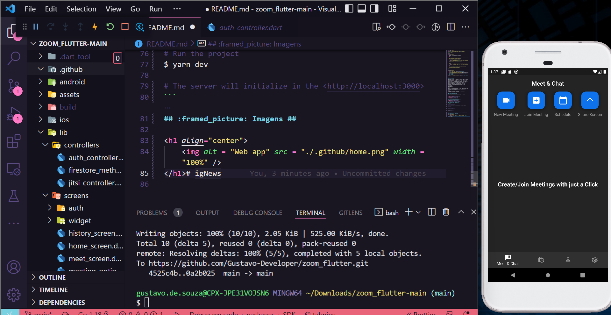

<h1 align="center">

</h1>

<p align="center">
  Zoom - A meeting app🚀
  <br>
  <br>

  


  <a href="https://github.com/gustavo-developer/zoom_flutter/commits/main">
    
  </a>

  
</p>


## :dart: Sobre ##

This project is a Clone of a Metting Zoom App


## :white_check_mark: Requerimentos ##

- [Flutter]
- [Android Studio]

## :checkered_flag: Começando ##

```bash
# Clone this project
$ git clone https://github.com/Gustavo-Developer/ignews

# Access
$ cd zoom_flutter

# Install dependencies
$ flutter pub get


```
## :framed_picture: Imagens ##

<h1 align="center">
    
</h1># igNews
